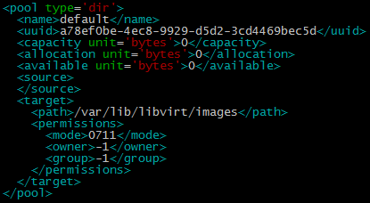
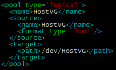
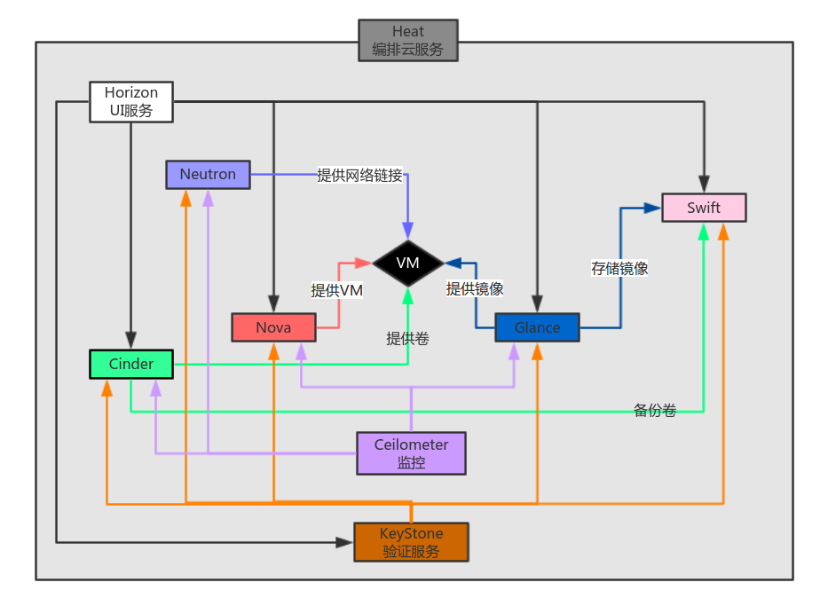
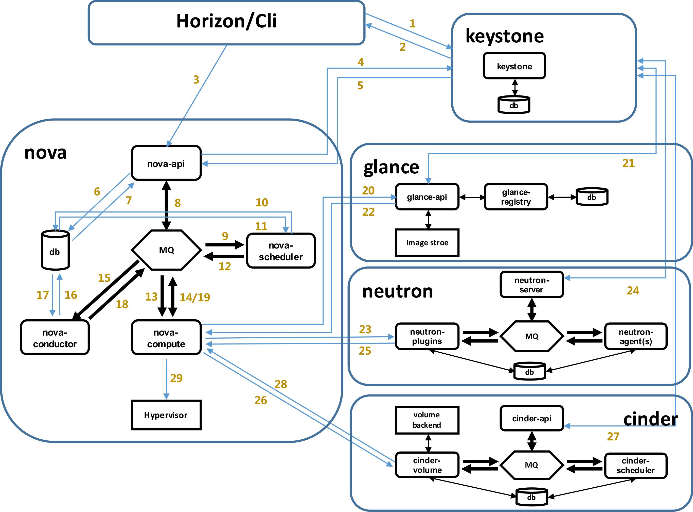
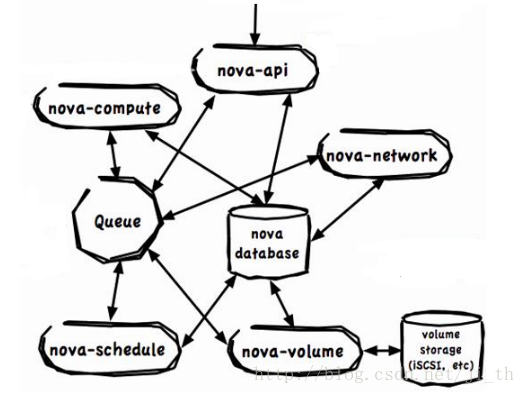
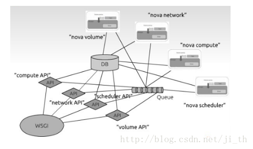
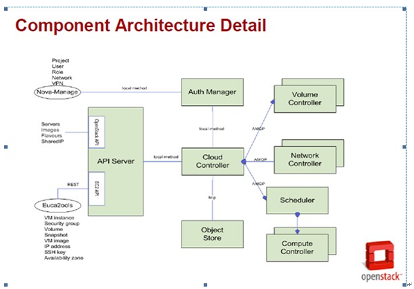
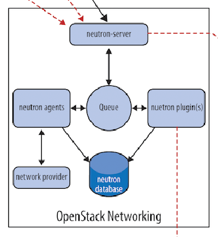
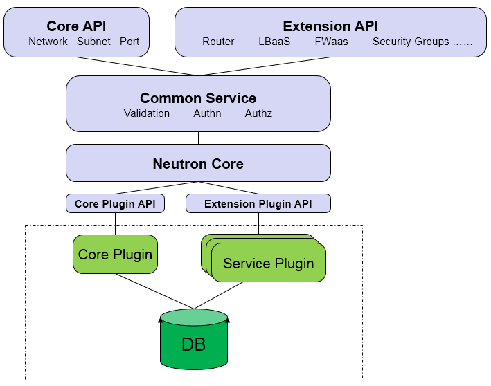
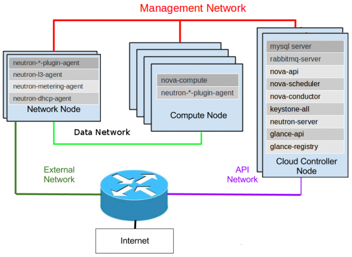

#openstack

## 综述

### openstack 的权限

> Openstack采用 Role-Based Access Control (RBAC) model 来进行权限管理，分为5种权限：
>
> admin(clound administrator):全局的角色，享有和管理nova的所有访问权限。
>
> itsec(It security): 限于IT安全管理人员，允许隔离所有project的实例。
>
> project manager：项目权限，提供添加用户到一个项目的权限，终止和启动实例，查询project images。
>
> netadmin(network administrator）: 项目一级的角色，允许分配和分配IP地址，创建和修改防火墙规则。
>
> Developer ：默认的一个角色。

### openstack 基础

1. hypervisor 虚拟化

   - 1型虚拟化
     Hypervisor 直接安装在物理机上，多个虚拟机在Hypervisor上运行， Hypervisor实现方式一般是一个特殊定制的Linux 系统， Xen 和VMware的ESXi都属于这个类型

   - 2型虚拟化
     物理机上首先安装常规的操作系统，比如 Redhat、Ubuntu 和 Windows。Hypervisor 作为 OS 上的一个程序模块运行，并对管理虚拟机进行管理。KVM、VirtualBox 和 VMWare Workstation 都属于这个类型。

2. libvirtd
   Libvirt 包含 3 个东西：后台 daemon 程序 libvirtd、API 库和命令行工具 virsh
   libvirtd是服务程序，接收和处理 API 请求；              
   API 库使得其他人可以开发基于 Libvirt 的高级工具，比如 virt-manager，这是个图形化的 KVM 管理工具，后面我们也会介绍；           
   virsh 是我们经常要用的 KVM 命令行工具，后面会有使用的示例。

3. cpu超配
   虚机的 vCPU 总数可以超过物理 CPU 数量，这个叫 CPU overcommit（超配）。
   KVM 允许 overcommit，这个特性使得虚机能够充分利用宿主机的 CPU 资源，但前提是在同一时刻，不是所有的虚机都满负荷运行。
   当然，如果每个虚机都很忙，反而会影响整体性能，所以在使用 overcommit 的时候，需要对虚机的负载情况有所了解，需要测试

4. mem超售
   为了在一台机器上运行多个虚拟机，KVM 需要实现 VA（虚拟内存） -> PA（物理内存） -> MA（机器内存）直接的地址转换。虚机 OS 控制虚拟地址到客户内存物理地址的映射 （VA -> PA），但是虚机 OS 不能直接访问实际机器内存，因此 KVM 需要负责映射客户物理内存到实际机器内存 （PA -> MA）。具体的实现就不做过多介绍了，大家有兴趣可以查查资料。
   还有一点提醒大家，内存也是可以 overcommit 的，即所有虚机的内存之和可以超过宿主机的物理内存。

5. 存储
   KVM 的存储虚拟化是通过存储池（Storage Pool）和卷（Volume）来管理的
   storage pool

   - 目录类型的storage pool
     kvm 将宿主机目录/var/lib/libvirt/images作为默认的storage pool
     volume就是目录下的文件，一个文件就是一个volume
     镜像文件 cirros-0.3.3-x8664-disk.img 放到了这个目录下。文件 cirros-0.3.3-x8664-disk.img 也就是Volume，对于 kvm1 来说，就是它的启动磁盘了

     KVM 所有可以使用的 Storage Pool 都定义在宿主机的 /etc/libvirt/storage 目录下，每个 Pool 一 个 xml 文件，默认有一个 default.xml

     

     KVM 支持多种 Volume 文件格式
     raw 是默认格式，即原始磁盘镜像格式，移植性好，性能好，但大小固定，不能节省磁盘空间。
     qcow2 是推荐使用的格式，cow 表示 copy on write，能够节省磁盘空间，支持 AES 加密，支持 zlib 压缩，支持多快照，功能很多。
     vmdk 是 VMWare 的虚拟磁盘格式，也就是说 VMWare 虚机可以直接在 KVM上 运行

   - lvm 型的

     

   - 其他类型的，例如ceph

6. Linux 网络接口配置(/etc/network/interfaces)

   初始化网口Ethernet Interface

   大部分的网络接口配置都可以在/etc/network/interfaces中解决，例如设置ip，配置路由，掩码，默认路由等。

   如果想要在系统启动时就启动网口，需要添加auto 一行

   >
   >
   >1. 配置DHCP 自动配置接口
   >
   >   auto eth0
   >     allow-hotplug eth0
   >     iface eth0 inet dhcp
   >
   >2. 手动配置网口
   >
   >   auto eth0
   >
   >   iface eth0 inet static
   >     address 192.0.2.7
   >     netmask 255.255.255.0
   >     gateway 192.0.2.254
   >
   >3. 启动网口但不配ip
   >
   >   如果想要创建一个没有ip地址的网口，就需要使用manual方法和pre-up, post-down来启动和关闭网口
   >
   >   iface eth0 inet manul
   >
   >      pre-up ifconfig $IFACE up
   >
   >     post-down ifconfig $IFACE down
   >
   >4. 创建vlan 设备
   >
   >   auto eth0.10
   >
   >   iface eth0.10 inet manual
   >
   >     vlan-raw-device eth0
   >
   >   auto brvlan10
   >
   >   iface brvlan10 inet manual
   >
   >     bridge_stp off
   >   
   >    bridge_waitport 0
   >   
   >    bridge_fd 0   #bridge_fd is the bridge forward delay time, in seconds, default 15.
   >   
   >    bridge_ports eth0.10

7. virbr0 是 KVM 默认创建的一个 Bridge，其作用是为连接其上的虚机网卡提供 NAT 访问外网的功能。


### openstack 组件逻辑关系



### openstack 新建云主机流程图



> 1. 界面或命令行通过RESTful API向keystone获取认证信息。
> 2. keystone通过用户请求认证信息，并生成auth-token返回给对应的认证请求。
> 3. 界面或命令行通过RESTful API向nova-api发送一个boot instance的请求（携带auth-token）。
> 4. nova-api接受请求后向keystone发送认证请求，查看token是否为有效用户和token。
> 5. keystone验证token是否有效，如有效则返回有效的认证和对应的角色（注：有些操作需要有角色权限才能操作）。
> 6. 通过认证后nova-api和数据库通讯。
> 7. 初始化新建虚拟机的数据库记录。
> 8. nova-api通过rpc.call向nova-scheduler请求是否有创建虚拟机的资源(Host ID)。
> 9. nova-scheduler进程侦听消息队列，获取nova-api的请求。
> 10. nova-scheduler通过查询nova数据库中计算资源的情况，并通过调度算法计算符合虚拟机创建需要的主机。
> 11. 对于有符合虚拟机创建的主机，nova-scheduler更新数据库中虚拟机对应的物理主机信息。
> 12. nova-scheduler通过rpc.cast向nova-compute发送对应的创建虚拟机请求的消息。
> 13. nova-compute会从对应的消息队列中获取创建虚拟机请求的消息。
> 14. nova-compute通过rpc.call向nova-conductor请求获取虚拟机消息。（Flavor）
> 15. nova-conductor从消息队队列中拿到nova-compute请求消息。
> 16. nova-conductor根据消息查询虚拟机对应的信息。
> 17. nova-conductor从数据库中获得虚拟机对应信息。
> 18. nova-conductor把虚拟机信息通过消息的方式发送到消息队列中。
> 19. nova-compute从对应的消息队列中获取虚拟机信息消息。
> 20. nova-compute通过keystone的RESTfull API拿到认证的token，并通过HTTP请求glance-api获取创建虚拟机所需要镜像。
> 21. glance-api向keystone认证token是否有效，并返回验证结果。
> 22. token验证通过，nova-compute获得虚拟机镜像信息(URL)。
> 23. nova-compute通过keystone的RESTfull API拿到认证k的token，并通过HTTP请求neutron-server获取创建虚拟机所需要的网络信息。
> 24. neutron-server向keystone认证token是否有效，并返回验证结果。
> 25. token验证通过，nova-compute获得虚拟机网络信息。
> 26. nova-compute通过keystone的RESTfull API拿到认证的token，并通过HTTP请求cinder-api获取创建虚拟机所需要的持久化存储信息。
> 27. cinder-api向keystone认证token是否有效，并返回验证结果。
> 28. token验证通过，nova-compute获得虚拟机持久化存储信息。
> 29. nova-compute根据instance的信息调用配置的虚拟化驱动来创建虚拟机。

### Hypervisor 

1. Hypervisor 一种运行在基础物理服务器和操作系统之间的中间软件层，可允许多个操作系统和应用共享硬件，也叫VMM，即虚拟监视器
2. Hypervisors是一种在虚拟环境中的“元”操作系统。他们可以访问服务器上包括磁盘和内存在内的所有物理设备。Hypervisors不但协调着这些硬件资源的访问，也同时在各个虚拟机之间施加防护。当服务器启动并执行Hypervisor时，它会加载所有虚拟机客户端的操作系统同时会分配给每一台虚拟机适量的内存，CPU，网络和磁盘。

Xen, KVM 都是Linux Hypervisor，但是它们进行虚拟化的方式却不尽相同。
Xen是安装在X86架构电脑上的一个虚拟机（VM）监控器。通过半虚拟化技术，Xen允许hypervisor和虚拟机互相进行通讯，这项技术落后于KVM

KVM 是基于内核的虚拟机

LXC : linux containers

## 消息总线


##nova 

### nova 逻辑架构



nova是云主机控制器。它包含了很多组件，API服务器（nova-api），计算服务器（nova-compute），网络控制器（nova-network），调度器（nova-schedule），卷控制器（nova-volume），消息队列以及DashBoard。

1. nova-api  

   起到cloud controller 的作用， 主要为所有的API查询提供了一个接口（比如Openstack API, EC2APi及管理员控制API), 引发众多业务流程的活动（比如运行一个实例），并实施一些政策（主要是配额检查）

   它接受用户请求，将指令发送至消息队列，有相应的服务执行相关指令消息

2. nova-scheduler

   接受一个消息队列的虚拟实例请求，通过算法决定该请求应该在那一台主机上运行，这个算法可以由我们指定，即起到调度器(Scheduler)的作用

3. nova-compute 

   是一个非常重要的守护进程，整合了计算资源CPU，存储，网络三类资源部署管理虚拟机，职责是基于各种虚拟化技术Hyperivisor负责创建和终止虚拟机实例，即管理着虚拟机的生命周期，该模块内部非常复杂，但原理就是接受队列的动作，接受消息队列中的执行指令，并执行相关指令，如部署虚拟机，维护数据库相关模型的状态数据并且更新数据库的数据

   compute的职责如下： 运行虚拟机，终止虚拟机，重启虚拟机，挂载虚拟机，挂载云硬盘，卸载云硬盘，控制台输出。

4. nova-volume/Cinder 的职责是创建，挂载，和卸载持久化的磁盘虚拟机，运行机制类似nova-compute。同样是接受消息队列中的执行指令，并执行相关指令。volume的职责包括如下：创建云硬盘，删除云硬盘，弹性计算硬盘。一句话：就是为虚拟机增加块设备存储

5. nova-network

   实现网络资源池的管理,包括IP池，网桥接口，VLAN，防火墙的管理。接受消息队列指令消息并执行。network的职责包括如下：分配私有云，VLAN管理，配置计算节点网络。Nova-network解决云计算网络资源池的网络问题。，然后执行相应的任务对网络进行操作（安装网桥和改变iptables）规则

6. Nova-conductor 

   介于nova-computer和database之间，设计目的在于消除直接nova-computer直接访问云数据库

7. Nova-dhcpbridge

    脚本，跟踪IP地址租约，并通过使用dnsmasq的DHCP脚本记录在数据库中

8. Nova-cert

   管理x509证书

9. queue

   为各个模块之间的通信提供起到一个集线器的作用，即数据交换中心，目前采用的是RabbitMQ

10. SQL database

    存储云基础设施构建时的状态，包括可用的实例类型，可用网络和项目，目前采用Mariadb

### nova 运行架构



nova-api对外统一提供标准化接口，各子模块，如计算资源，存储资源和网络资源子模块通过相应的API接口服务对外提供服务。

> 这里的WSGI就是nova-api。API接口操作DB实现资源数据模型的维护。通过消息中间件，通知相应的守护进程如nova-compute等实现服务接口。API与守护进程共享DB数据库，但守护进程侧重维护状态信息，网络资源状态等。守护进程之间不能直接调用，需要通过API调用，如nova-compute为虚拟机分配网络，需要调用network-api，而不是直接调用nova-network，这样有易于解耦合。
>
> 下面以创建虚拟机为例，分析Nova的不同关键子模块之间的调用关系。因为启动一个新的instance涉及到很多openstacknova里面的组件共同协作。
>
> 1、通过调用nova-api创建虚拟机接口，nova-api对参数进行解析以及初步合法性校验，调用compute-api创建虚拟机VM接口，compute-api根据虚拟机参数（CPU，内存，磁盘，网络，安全组等）信息，访问数据库创建数据模型虚拟机实例记录（创建1个虚拟机实例）
>
> 2、接下来需要调用具体的物理机实现虚拟机部署，在这里就会涉及调度模块novascheduler，compute-api通过RPC的方式将创建虚拟机的基础信息封装成消息发送至消息中间件指定消息队列“scheduler”。
>
> 3.nova-scheduler订阅了消息队列“scheduler”的内容，接受到创建虚拟机的消息后，进行过滤，根据请求的虚拟资源，即flavor的信息。scheduler会找到一个可用的主机，如果没有找到就设置虚拟机的状态设置成ERROR选择一台物理主机部署，如果有主机，如物理主机A。nova-scheduler将虚拟机基本信息，所属物理主机信息发送至消息中间件指定消息队列“compute.物理机A”
>
> 4.物理机A上nova-compute守护进程订阅消息队列“compute.物理机A”，接到消息后，根据虚拟机基本信息开始创建虚拟机
>
> 5.nova-compute调用network-api分配网络ip
>
> 6.nova-network接收到消息就，从fixedIP表(数据库)里拿出一个可用IP，nova-network根据私网资源池，结合DHCP，实现IP分配和IP地址绑定
>
> 7.nova-compute通过调用volume-api实现存储划分，最后调用底层虚拟化Hypervisor技术，部署虚拟机。

### nova 常用命令

1. 查看计算节点资源使用量

   - openstack host show "compute-node.name"
   - nova host-describe 'compute-node.name'
   - openstack host list 

   ```
   # openstack host show node-4.domain.tld
   +-------------------+--------------------------+-----+-----------+---------+
   | Host              | Project                          | CPU | Memory MB | Disk GB |
   +-------------------+--------------------------+-----+-----------+---------+
   | node-4.domain.tld | (total)                          |   4 |     16070 |    1861 |
   | node-4.domain.tld | (used_now)                       |   2 |      2048 |      40 |
   | node-4.domain.tld | (used_max)                       |   2 |      1536 |      40 |
   | node-4.domain.tld | d0d115b85cda44f3a6e982883b9ec354 |   2 |      1536 |      40 |
   +-------------------+-------------------------+-----+-----------+-----
   ```

   显示了计算节点上资源的使用情况，包括：总量(total)，当前使用量(used_now)和每个租户的使用量(project)。在这里host又代表的是compute_node

   迁移之前会查看目标主机的资源容量是否满足迁移实例的大小，即会比较的是剩余容量，但是调度模块那的过滤调度部分，对于内存过滤来说，允许过载，有过载比例的设置，故此在剩余容量为0后，仍能调度创建。


### nova 源代码结构

> **源代码结构如下：**
>
> nova.api.ec2：实现Amazon EC2 AWS的API。注意euca2ools就是通过这个API接口实现对云平台的管理
>
> nova.api.openstack：实现Openstack的API。nova-manage使用该接口，这是Openstack云管理平台的标准，目前还在制定过程中。Openstack网站上的“OpenStack Compute Developer Guide API 1.1”就是描述的这个部分。由于这一部分还在进化过程中，我们不能完全地据此进行。
>
> nova.auth：与认证和授权的相关内容都在这里。基本按照Amazon EC2的IAM结构进行管理的。
>
> nova.cloudpipe: 为project创建VPN服务器的代码。从代码上看，VPN实际上是云中一个tiny类型的虚拟机，在上面有一个VPN服务器。
>
> nova.compute: 计算节点的相关代码，api.py中定义了compute节点的详细接口。Api.py将请求转化成在AMQP消息发送出去，交给manager.py中的ComputeManager去运行。
>
> nova.console：Nova增强了它的控制台服务。控制台服务允许用户可以通过代理服务器访问虚拟化实例。这就涉及了一对新的守护进程（nova-console和nova-consoleauth).
>
> nova.db：数据库操作
>
> nova.image: image管理的代码都在这里。service.py定义了image管理的相关接口，后端有三个driver: glance, local, 和s3. 分别使用不同的后端存储来存放image。service.BaseImageService定义了image管理的接口。每个成员方法都有详细的描述。
>
> nova.ipv6: ipv6地址操作类
>
> nova.network: 与网络相关的配置都在这里
>
> nova.notifier: 事件通知器，就目前的代码来看，这个通知器好像还没有被使用起来。
>
> nova-object store 提供的是简单存储服务
>
> nova.scheduler：各种Scheduler。。。
>
> nova.test：各种test。

### **概念框架与逻辑框架的对应关系**


### 系统框架



### 模块介绍

> - cloud Controller  由许多组件构成，代表了全局状态，并负责和其他所有组件交互
> - API Server 为Cloud Controller 担当一个Web Servicee的前端角色
> - Compute controller 提供计算服务
> - object store 提供存储服务
> - Auth manager 提供认证授权服务
> - Volume controller 为计算服务器提供快速，持久化块级存储
> - Network controller 提供了计算服务器之间及计算服务和公网网络的交互
> - Scheduler 选择一个合适的实例计算控制器

OpenStack Compute 是一个无共享，基于消息的框架。Cloud Controller与Object Store之间通过HTTP进行交互，与Network controller，Volume controller，Scheduler 之间采用 AMQP进行交互，为防止阻塞，OpenStack Compute采用异步调用机制。


 ### nova 表结构

|                                     |                                                              |
| ----------------------------------- | :----------------------------------------------------------- |
| **表 名**                           | **表的作用**                                                 |
| auto_tokens                         | 所有API事物认证令牌相关参数                                  |
| certificates                        | x509证书相关参数                                             |
| compute_nodes                       | 运行的计算结点服务相关参数                                   |
| console_pools                       |                                                              |
| consoles                            | 实例控制台会话                                               |
| export_devices                      |                                                              |
| fixed_ips                           | 分配的固定ip                                                 |
| floating_ips                        | 动态ip                                                       |
| instances_action                    | 客户端实例的创建，更新，删除等动作和结果相关参数             |
| instance_metadata                   | 实例元数据key/value对                                        |
| instance_types                      | 实例类型相关，有五种实例：m1.medium,m1.tiny,m1.large,m1.xlarge,m1.small |
| instances                           | 客户端虚拟机实例相关参数，包括相关属性跟动作                 |
| iscsi_targets                       | 主机的iscsi 目标器                                           |
| key_pairs                           | 存储密钥对的相关信息，私钥发给用户公钥存储数据库             |
| migrate_version                     |                                                              |
| migrations                          | 运行实例迁移                                                 |
| networks                            | 网络相关的参数                                               |
| projects                            | 项目相关的参数                                               |
| quotas                              | 项目的配额                                                   |
| security_group_instance_association |                                                              |
| security_group _rules               |                                                              |
| security_groups                     |                                                              |
| services                            | 在主机上运行的服务                                           |
| user_project_ association           |                                                              |
| user_project_role _association      |                                                              |
| user_role_ association              |                                                              |
| users                               | 用户相关参数                                                 |
| volumes                             | 块存储设备                                                   |
| zones                               |                                                              |

## Neutron

 提供了虚拟网络使虚拟主机之间以及与外部网络通信。网络模型分为以下三种。这三种模型可以共存在一个云系统中，但是在一个计算节点上只能配备一种模型。

> 扁平网络 （FlatNetwork）：在创建虚拟主机时，nova-network会从指定子网中取一个空闲IP并将它写入此虚拟主机的配置文件。在一个子网内的虚拟主机可以通过创建Linux桥实现互通。

>  带DHCP功能的扁平网络 （Flat DHCPNetwork）：顾名思义，此种模式相对于扁平网络加入了DHCP功能。在创建虚拟主机时，nova-network会在指定的子网中为此虚拟主机分配IP和物理地址，并将这些信息告知DHCP服务器（默认是dnsmasq）。DHCP服务器会监听虚拟主机所在的桥。当有虚拟主机启动时，会自动从DHCP服务器获得IP。可以看到DHCP服务器只是按照nova-network给定的列表（IP和物理地址）分发IP，如何分配还是nova-network说了算。

> VLAN网络 （VLANNetwork）：这是nova-network的默认模型。针对每个项目（Project，如今Openstack把项目改称租户 --Tenant），都会对应一个vlan。每个项目里的私有IP地址只能在本项目的vlan里访问。与项目对应的vlan需要子网，这个子网是由管理员动态分配给项目的。与带DHCP功能的扁平网络类似，子网内的IP地址也是通过DHCP服务器分发的。所有在一个子网内的虚拟主机都通过网桥互通。

### neutron 逻辑架构



1. Neutron Server:  这一部分包含守护进程neutron-server 和各种插件neutron-*-plugin,他们既可以安装在控制节点也可以安装在网络节点，neutron-server 提供API接口，并把对API的调用请求传给已经配置好的插件进行后续处理，插件需要维护数据库中各种配置数据的对应关系，如 路由器， 网络， 子网， 端口， 浮动ip， 安全组等等

2. plugin Agent:  虚拟网络上的数据包的处理是由这些插件代理来完成的，名字为neutron-*-agent ， 在每个计算节点和网络节点上运行，一般来说，你选择了什么插件，就要选择相应的代理，代理和NeutronServer 及其插件的交互就通过消息队列来支持
3. DHCP Agent: 名字为neutron-dhcp-agent , 为各个租户网络提供DHCP服务，部署在网络节点上，各个插件也是使用这一个代理
4. L3 Agent: 名字为neutron-l3-agent, 为客户机访问外部网络提供三层转发服务，也部署在网络节点上

### neutron-server 结构



api

> - APICore：暂且称之为API核。它可以看做是插件功能的最小集合，即每个插件都必须有的功能，也就是对网络、子网和端口的查询、加删和更新操作等。
>
> - APIExtensions：暂称之为API扩展。它们一般是针对具体插件实现的，这样租户就可以利用这些插件独特的功能，比方说访问控制（ACL)和QoS。  

plugin

从功能上来讲， 插件有以下内容

> - 存储当前逻辑网络的配置信息，这就需要一个数据库，比方说MySQL
> - 判断和存储逻辑网络和物理网络的对应关系，比方说为一个逻辑网络选择一个vlan
> - 与一种或多种交换机通信来实现这种对应关系。这一般通过宿主机上的插件代理来实现这种操作，或者远程登录到交换机上来配置

配置模型

把Neutron Server放在控制节点上，DHCP和L3代理放在网络节点上




### command

```shell
#brctl addbr br0  # 创建一个虚拟以太网桥接口， 在主机bridge上执行
#brctl stp br0 off  # 我们不需要stp(生成树协议）
#brctl addif br0 eth0 # 将以太物理接口附加到刚生成的逻辑网桥接口br0上， 原来我们的以太网物理接口变成了网桥上的两个逻辑端口，现在他们成了逻辑网桥的一部分了， 所以也不需要ip地址了,下面释放ip地址
#ifconfig eth0 down 
#ifconfig eth0 0.0.0.0 up
```

### links

gre: http://www.aboutyun.com/thread-13008-1-1.html

vlan:  http://www.aboutyun.com/thread-13026-1-1.html

xvlan: http://www.aboutyun.com/thread-13027-1-1.html

### openvswitch

openvswitch 是运行在虚拟平台上的虚拟交换机， 在虚拟化平台上， ovs 可以为动态变化的端点提供二层交换功能， 很好的控制虚拟网络中的访问策略，网络隔离，流量监控

关键概念： 

- Bridge: bridge 代表一个以太网交换机（Switch), 一个主机中可以创建一个或者多个Bridge设备
- Port: 端口与物理交换机的端口概念类似， 每个端口都隶属于一个Bridge
- Interface: 连接到端口的网络接口设置， 通常情况下， Port和Interface 是一对一的关系，只有在配置Port为Bond模式后，Port和Interface 才是一对多的关系
- Controller: OpenFlow 控制器， OVS可以同时接受一个或多个OpenFlow 控制器的管理
- dataPath： 在OVS中， datapath 负责执行数据交换，也就是说从接收端口收到的数据包在流表中进行匹配，并执行匹配到的动作
- Flow table : 每个datapath 都和一个flow table 关联，当datapath 接受到数据后， ovs会在flow table中查找可以匹配的flow，执行对应的操作，例如转发数据

ovs-vsctl 查询和更新 ovs-vswitchd 的配置

1. 添加/删除名为br0 的网桥

   ovs-vsctl add-br/del-br br0

2. 列出所有网桥

   ovs-vsctl list-br

3. 判断网桥是否存在

   ovs-vsctl br-exists br0

4. 列出挂接到网桥br0上的所有网络接口

   ovs-vsctl list-ports br0

5. 将网络接口eth0 挂接/删除 br0 

   ovs-vsctl add-port/del-port br0 eth0

6. 列出已挂接eth0 网络接口的网桥

   ovs-vsctl port-to-br eth0

7. 查看虚拟机内的网卡/list all domain virtual interfaces

   virsh domiflist instance-00000020

vsdb 操作

8. ovsdb 是一个轻量级的数据库，数据库操作的一般格式：

   ovs-vsctl list/set/get/add/remove/clear/destroy table record column [value]

   默认情况下， ovsdb 中有以下数据表     bridge,controller,interface,mirror,netflow,open_vswitch,port,qos,queue,ssl,sflow

9. 查看bridge数据表中所有记录
    ovs-vsctl list bridge

10. 获取bridge 的_uuid/datapath_type 字段
  ovs-vsctl get bridge br-int _uuid/datapath_type

流表操作

8. 查看虚拟交换机的信息
   ovs-ofctl show br-int
9. 查看某个网桥上的端口状态信息
   ovs-ofctl dump-ports br-int
10. 查看网桥上所有的流规则
   ovs-ofctl dump-flows br-int

Qos 设置

11. Qos 可以针对网络接口，也可以针对端口设置

    ```
    #ovs-vsctl set interface tap-xxx ingress_policing_rate=1000
    #ovs-vsctl set interface tap-xxx ingress_policing_burst=100
    ```

端口映射

12. 将发往p0端口和从p1端口发出的数据包全部定向到p2端口，用ovs-vsctl list port 查看p0,p1,p2的uuid为id1, id2, id3

    ```
    ovs-vsctl --set bridge br0 mirrors=@m-- --id=@m create mirror name=mymirror select-dst-port=id_1 select-src-port=id_2 output-port=id3
    ```

### namespace

netns是在linux中提供网络虚拟化的一个项目，使用netns网络空间虚拟化可以在本地虚拟化出多个网络环境，目前netns在lxc容器中被用来为容器提供网络。

> ip netns list - show all of the named network namespaces 列出所有名称空间
> ip netns add NETNSNAME - create a new named network namespace 创建一个新的名称空间
> ip netns delete NETNSNAME - delete the name of a network namespace 删除一个名称空间
> ip netns exec NETNSNAME cmd ... - Run cmd in the named network namespace 在网络名称空间中执行系统命令
>
> ip [-all] netns exec [ NAME ] cmd ... - Run cmd in the named network namespace.
>   If -all option was specified then cmd will be executed synchronously on the each named network namespace.

ip link 

创建虚拟设备

ip link 查看所有设备

ip link shwo 显示设备属性

ip link add   新增虚拟设备


veth设备是成对出现的，一端连接的是内核协议栈，一端彼此相连。一个设备收到协议栈的数据，会将数据发送另一个设备上去

## cinder

提升某个租户的配额

```
cinder quota-update --backup-gigabytes 备份空间大小 $tenantid
```

```shell
#keystone tenant-list
+----------------------------------+----------+---------+
|                id                |   name   | enabled |
+----------------------------------+----------+---------+
| 565ef74e3555421fb4ce8e21c352de16 |  admin   |   True  |
| 8a1021dd9aca4c2bbc379da5b73a4172 | services |   True  |
+----------------------------------+----------+---------+

#cinder quota-show 565ef74e3555421fb4ce8e21c352de16
+----------------------+-------+
|       Property       | Value |
+----------------------+-------+
|   backup_gigabytes   |  1000 |
|       backups        |   10  |
|      gigabytes       |  1000 |
| per_volume_gigabytes |   -1  |
|      snapshots       |   10  |
|       volumes        |   10  |
+----------------------+-------+
# cinder quota-update --backup-gigabytes 2000 565ef74e3555421fb4ce8e21c352de16
+----------------------+-------+
|       Property       | Value |
+----------------------+-------+
|   backup_gigabytes   |  2000 |
|       backups        |   10  |
|      gigabytes       |  1000 |
| per_volume_gigabytes |   -1  |
|      snapshots       |   10  |
|       volumes        |   10  |
+----------------------+-------+

```


## Pacemaker

- pacemaker 资源管理器(CRM),负责启动和停止服务，而且保证他们是一直运行着的以及某个时刻某服务只在一个节点上运行，避免多服务同时操作数据库造成的混乱

- Corosync - 消息层组件（Messaging Layer），管理成员关系、消息和仲裁

- Resource Agents - 资源代理，实现在节点上接收 CRM 的调度对某一个资源进行管理的工具，这个管理的工具通常是脚本，所以我们通常称为资源代理。任何资源代理都要使用同一种风格，接收四个参数：{start|stop|restart|status}，包括配置IP地址的也是。每个种资源的代理都要完成这四个参数据的输出。Pacemaker 的 RA 可以分为三种：（1）Pacemaker 自己实现的 （2）第三方实现的，比如 RabbitMQ 的 RA （3）自己实现的，比如 OpenStack 实现的它的各种服务的RA

pacemaker 支持多种类型的集群， 包括Active/Active, Active/Passive, N+1, N to 1 ...

corosync 用于高可用环境中提供通讯服务，位于高可用集群架构中的底层，扮演着为各节点之间提供心跳信息传递这样的功能。

fencing agent 是在一个节点不稳定或者无答复时将其关闭，使得他不会损坏集群的其他资源，主要是用来消除脑裂。通常有两种类型的fencing agent : power, storage 。 power类型的agent会将节点的电源断电， storage类型的agent会确保其某一时刻只有一个节点会读写共享的存储。


### command

1. 重启资源

   ```
   crm resource restart clone_p_haproxy 
   ```


## RabbitMQ 


### 

```


```

