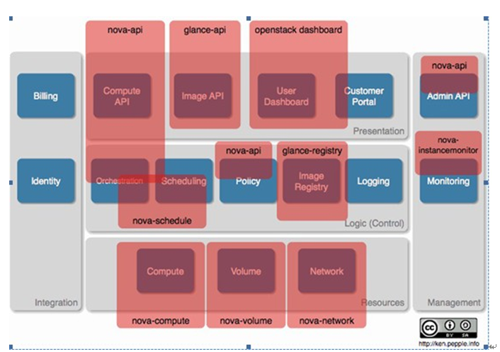

#openstack

## 综述

### openstack 的权限

> Openstack采用 Role-Based Access Control (RBAC) model 来进行权限管理，分为5种权限：
>
> admin(clound administrator):全局的角色，享有和管理nova的所有访问权限。
>
> itsec(It security): 限于IT安全管理人员，允许隔离所有project的实例。
>
> project manager：项目权限，提供添加用户到一个项目的权限，终止和启动实例，查询project images。
>
> netadmin(network administrator）: 项目一级的角色，允许分配和分配IP地址，创建和修改防火墙规则。
>
> Developer ：默认的一个角色。

### openstack 组件逻辑关系


### openstack 新建云主机流程图


> 1. 界面或命令行通过RESTful API向keystone获取认证信息。
> 2. keystone通过用户请求认证信息，并生成auth-token返回给对应的认证请求。
> 3. 界面或命令行通过RESTful API向nova-api发送一个boot instance的请求（携带auth-token）。
> 4. nova-api接受请求后向keystone发送认证请求，查看token是否为有效用户和token。
> 5. keystone验证token是否有效，如有效则返回有效的认证和对应的角色（注：有些操作需要有角色权限才能操作）。
> 6. 通过认证后nova-api和数据库通讯。
> 7. 初始化新建虚拟机的数据库记录。
> 8. nova-api通过rpc.call向nova-scheduler请求是否有创建虚拟机的资源(Host ID)。
> 9. nova-scheduler进程侦听消息队列，获取nova-api的请求。
> 10. nova-scheduler通过查询nova数据库中计算资源的情况，并通过调度算法计算符合虚拟机创建需要的主机。
> 11. 对于有符合虚拟机创建的主机，nova-scheduler更新数据库中虚拟机对应的物理主机信息。
> 12. nova-scheduler通过rpc.cast向nova-compute发送对应的创建虚拟机请求的消息。
> 13. nova-compute会从对应的消息队列中获取创建虚拟机请求的消息。
> 14. nova-compute通过rpc.call向nova-conductor请求获取虚拟机消息。（Flavor）
> 15. nova-conductor从消息队队列中拿到nova-compute请求消息。
> 16. nova-conductor根据消息查询虚拟机对应的信息。
> 17. nova-conductor从数据库中获得虚拟机对应信息。
> 18. nova-conductor把虚拟机信息通过消息的方式发送到消息队列中。
> 19. nova-compute从对应的消息队列中获取虚拟机信息消息。
> 20. nova-compute通过keystone的RESTfull API拿到认证的token，并通过HTTP请求glance-api获取创建虚拟机所需要镜像。
> 21. glance-api向keystone认证token是否有效，并返回验证结果。
> 22. token验证通过，nova-compute获得虚拟机镜像信息(URL)。
> 23. nova-compute通过keystone的RESTfull API拿到认证k的token，并通过HTTP请求neutron-server获取创建虚拟机所需要的网络信息。
> 24. neutron-server向keystone认证token是否有效，并返回验证结果。
> 25. token验证通过，nova-compute获得虚拟机网络信息。
> 26. nova-compute通过keystone的RESTfull API拿到认证的token，并通过HTTP请求cinder-api获取创建虚拟机所需要的持久化存储信息。
> 27. cinder-api向keystone认证token是否有效，并返回验证结果。
> 28. token验证通过，nova-compute获得虚拟机持久化存储信息。
> 29. nova-compute根据instance的信息调用配置的虚拟化驱动来创建虚拟机。

### Hypervisor 

1. Hypervisor 一种运行在基础物理服务器和操作系统之间的中间软件层，可允许多个操作系统和应用共享硬件，也叫VMM，即虚拟监视器
2. Hypervisors是一种在虚拟环境中的“元”操作系统。他们可以访问服务器上包括磁盘和内存在内的所有物理设备。Hypervisors不但协调着这些硬件资源的访问，也同时在各个虚拟机之间施加防护。当服务器启动并执行Hypervisor时，它会加载所有虚拟机客户端的操作系统同时会分配给每一台虚拟机适量的内存，CPU，网络和磁盘。

Xen, KVM 都是Linux Hypervisor，但是它们进行虚拟化的方式却不尽相同。
Xen是安装在X86架构电脑上的一个虚拟机（VM）监控器。通过半虚拟化技术，Xen允许hypervisor和虚拟机互相进行通讯，这项技术落后于KVM

KVM 是基于内核的虚拟机

LXC : linux containers

##nova 

### nova 逻辑架构


nova是云主机控制器。它包含了很多组件，API服务器（nova-api），计算服务器（nova-compute），网络控制器（nova-network），调度器（nova-schedule），卷控制器（nova-volume），消息队列以及DashBoard。

1. nova-api  

   起到cloud controller 的作用， 主要为所有的API查询提供了一个接口（比如Openstack API, EC2APi及管理员控制API), 引发众多业务流程的活动（比如运行一个实例），并实施一些政策（主要是配额检查）

   它接受用户请求，将指令发送至消息队列，有相应的服务执行相关指令消息

2. nova-scheduler

   接受一个消息队列的虚拟实例请求，通过算法决定该请求应该在那一台主机上运行，这个算法可以由我们指定，即起到调度器(Scheduler)的作用

3. nova-compute 

   是一个非常重要的守护进程，整合了计算资源CPU，存储，网络三类资源部署管理虚拟机，职责是基于各种虚拟化技术Hyperivisor负责创建和终止虚拟机实例，即管理着虚拟机的生命周期，该模块内部非常复杂，但原理就是接受队列的动作，接受消息队列中的执行指令，并执行相关指令，如部署虚拟机，维护数据库相关模型的状态数据并且更新数据库的数据

   compute的职责如下： 运行虚拟机，终止虚拟机，重启虚拟机，挂载虚拟机，挂载云硬盘，卸载云硬盘，控制台输出。

4. nova-volume/Cinder 的职责是创建，挂载，和卸载持久化的磁盘虚拟机，运行机制类似nova-compute。同样是接受消息队列中的执行指令，并执行相关指令。volume的职责包括如下：创建云硬盘，删除云硬盘，弹性计算硬盘。一句话：就是为虚拟机增加块设备存储

5. nova-network

   实现网络资源池的管理,包括IP池，网桥接口，VLAN，防火墙的管理。接受消息队列指令消息并执行。network的职责包括如下：分配私有云，VLAN管理，配置计算节点网络。Nova-network解决云计算网络资源池的网络问题。，然后执行相应的任务对网络进行操作（安装网桥和改变iptables）规则

6. Nova-conductor 

   介于nova-computer和database之间，设计目的在于消除直接nova-computer直接访问云数据库

7. Nova-dhcpbridge

    脚本，跟踪IP地址租约，并通过使用dnsmasq的DHCP脚本记录在数据库中

8. Nova-cert

   管理x509证书

9. queue

   为各个模块之间的通信提供起到一个集线器的作用，即数据交换中心，目前采用的是RabbitMQ

10. SQL database

    存储云基础设施构建时的状态，包括可用的实例类型，可用网络和项目，目前采用Mariadb

### nova 运行架构


nova-api对外统一提供标准化接口，各子模块，如计算资源，存储资源和网络资源子模块通过相应的API接口服务对外提供服务。

> 这里的WSGI就是nova-api。API接口操作DB实现资源数据模型的维护。通过消息中间件，通知相应的守护进程如nova-compute等实现服务接口。API与守护进程共享DB数据库，但守护进程侧重维护状态信息，网络资源状态等。守护进程之间不能直接调用，需要通过API调用，如nova-compute为虚拟机分配网络，需要调用network-api，而不是直接调用nova-network，这样有易于解耦合。
>
> 下面以创建虚拟机为例，分析Nova的不同关键子模块之间的调用关系。因为启动一个新的instance涉及到很多openstacknova里面的组件共同协作。
>
> 1、通过调用nova-api创建虚拟机接口，nova-api对参数进行解析以及初步合法性校验，调用compute-api创建虚拟机VM接口，compute-api根据虚拟机参数（CPU，内存，磁盘，网络，安全组等）信息，访问数据库创建数据模型虚拟机实例记录（创建1个虚拟机实例）
>
> 2、接下来需要调用具体的物理机实现虚拟机部署，在这里就会涉及调度模块novascheduler，compute-api通过RPC的方式将创建虚拟机的基础信息封装成消息发送至消息中间件指定消息队列“scheduler”。
>
> 3.nova-scheduler订阅了消息队列“scheduler”的内容，接受到创建虚拟机的消息后，进行过滤，根据请求的虚拟资源，即flavor的信息。scheduler会找到一个可用的主机，如果没有找到就设置虚拟机的状态设置成ERROR选择一台物理主机部署，如果有主机，如物理主机A。nova-scheduler将虚拟机基本信息，所属物理主机信息发送至消息中间件指定消息队列“compute.物理机A”
>
> 4.物理机A上nova-compute守护进程订阅消息队列“compute.物理机A”，接到消息后，根据虚拟机基本信息开始创建虚拟机
>
> 5.nova-compute调用network-api分配网络ip
>
> 6.nova-network接收到消息就，从fixedIP表(数据库)里拿出一个可用IP，nova-network根据私网资源池，结合DHCP，实现IP分配和IP地址绑定
>
> 7.nova-compute通过调用volume-api实现存储划分，最后调用底层虚拟化Hypervisor技术，部署虚拟机。

### nova 源代码结构

> **源代码结构如下：**
>
> nova.api.ec2：实现Amazon EC2 AWS的API。注意euca2ools就是通过这个API接口实现对云平台的管理
>
> nova.api.openstack：实现Openstack的API。nova-manage使用该接口，这是Openstack云管理平台的标准，目前还在制定过程中。Openstack网站上的“OpenStack Compute Developer Guide API 1.1”就是描述的这个部分。由于这一部分还在进化过程中，我们不能完全地据此进行。
>
> nova.auth：与认证和授权的相关内容都在这里。基本按照Amazon EC2的IAM结构进行管理的。
>
> nova.cloudpipe: 为project创建VPN服务器的代码。从代码上看，VPN实际上是云中一个tiny类型的虚拟机，在上面有一个VPN服务器。
>
> nova.compute: 计算节点的相关代码，api.py中定义了compute节点的详细接口。Api.py将请求转化成在AMQP消息发送出去，交给manager.py中的ComputeManager去运行。
>
> nova.console：Nova增强了它的控制台服务。控制台服务允许用户可以通过代理服务器访问虚拟化实例。这就涉及了一对新的守护进程（nova-console和nova-consoleauth).
>
> nova.db：数据库操作
>
> nova.image: image管理的代码都在这里。service.py定义了image管理的相关接口，后端有三个driver: glance, local, 和s3. 分别使用不同的后端存储来存放image。service.BaseImageService定义了image管理的接口。每个成员方法都有详细的描述。
>
> nova.ipv6: ipv6地址操作类
>
> nova.network: 与网络相关的配置都在这里
>
> nova.notifier: 事件通知器，就目前的代码来看，这个通知器好像还没有被使用起来。
>
> nova-object store 提供的是简单存储服务
>
> nova.scheduler：各种Scheduler。。。
>
> nova.test：各种test。

### **概念框架与逻辑框架的对应关系**



### 系统框架


### 模块介绍

> - cloud Controller  由许多组件构成，代表了全局状态，并负责和其他所有组件交互
> - API Server 为Cloud Controller 担当一个Web Servicee的前端角色
> - Compute controller 提供计算服务
> - object store 提供存储服务
> - Auth manager 提供认证授权服务
> - Volume controller 为计算服务器提供快速，持久化块级存储
> - Network controller 提供了计算服务器之间及计算服务和公网网络的交互
> - Scheduler 选择一个合适的实例计算控制器

OpenStack Compute 是一个无共享，基于消息的框架。Cloud Controller与Object Store之间通过HTTP进行交互，与Network controller，Volume controller，Scheduler 之间采用 AMQP进行交互，为防止阻塞，OpenStack Compute采用异步调用机制。


 ### nova 表结构

|                                     |                                                              |
| ----------------------------------- | :----------------------------------------------------------- |
| **表 名**                           | **表的作用**                                                 |
| auto_tokens                         | 所有API事物认证令牌相关参数                                  |
| certificates                        | x509证书相关参数                                             |
| compute_nodes                       | 运行的计算结点服务相关参数                                   |
| console_pools                       |                                                              |
| consoles                            | 实例控制台会话                                               |
| export_devices                      |                                                              |
| fixed_ips                           | 分配的固定ip                                                 |
| floating_ips                        | 动态ip                                                       |
| instances_action                    | 客户端实例的创建，更新，删除等动作和结果相关参数             |
| instance_metadata                   | 实例元数据key/value对                                        |
| instance_types                      | 实例类型相关，有五种实例：m1.medium,m1.tiny,m1.large,m1.xlarge,m1.small |
| instances                           | 客户端虚拟机实例相关参数，包括相关属性跟动作                 |
| iscsi_targets                       | 主机的iscsi 目标器                                           |
| key_pairs                           | 存储密钥对的相关信息，私钥发给用户公钥存储数据库             |
| migrate_version                     |                                                              |
| migrations                          | 运行实例迁移                                                 |
| networks                            | 网络相关的参数                                               |
| projects                            | 项目相关的参数                                               |
| quotas                              | 项目的配额                                                   |
| security_group_instance_association |                                                              |
| security_group _rules               |                                                              |
| security_groups                     |                                                              |
| services                            | 在主机上运行的服务                                           |
| user_project_ association           |                                                              |
| user_project_role _association      |                                                              |
| user_role_ association              |                                                              |
| users                               | 用户相关参数                                                 |
| volumes                             | 块存储设备                                                   |
| zones                               |                                                              |

## Neutron

 提供了虚拟网络使虚拟主机之间以及与外部网络通信。网络模型分为以下三种。这三种模型可以共存在一个云系统中，但是在一个计算节点上只能配备一种模型。

> 扁平网络 （FlatNetwork）：在创建虚拟主机时，nova-network会从指定子网中取一个空闲IP并将它写入此虚拟主机的配置文件。在一个子网内的虚拟主机可以通过创建Linux桥实现互通。

>  带DHCP功能的扁平网络 （Flat DHCPNetwork）：顾名思义，此种模式相对于扁平网络加入了DHCP功能。在创建虚拟主机时，nova-network会在指定的子网中为此虚拟主机分配IP和物理地址，并将这些信息告知DHCP服务器（默认是dnsmasq）。DHCP服务器会监听虚拟主机所在的桥。当有虚拟主机启动时，会自动从DHCP服务器获得IP。可以看到DHCP服务器只是按照nova-network给定的列表（IP和物理地址）分发IP，如何分配还是nova-network说了算。

> VLAN网络 （VLANNetwork）：这是nova-network的默认模型。针对每个项目（Project，如今Openstack把项目改称租户 --Tenant），都会对应一个vlan。每个项目里的私有IP地址只能在本项目的vlan里访问。与项目对应的vlan需要子网，这个子网是由管理员动态分配给项目的。与带DHCP功能的扁平网络类似，子网内的IP地址也是通过DHCP服务器分发的。所有在一个子网内的虚拟主机都通过网桥互通。

### neutron 逻辑架构


1. Neutron Server:  这一部分包含守护进程neutron-server 和各种插件neutron-*-plugin,他们既可以安装在控制节点也可以安装在网络节点，neutron-server 提供API接口，并把对API的调用请求传给已经配置好的插件进行后续处理，插件需要维护数据库中各种配置数据的对应关系，如 路由器， 网络， 子网， 端口， 浮动ip， 安全组等等

2. plugin Agent:  虚拟网络上的数据包的处理是由这些插件代理来完成的，名字为neutron-*-agent ， 在每个计算节点和网络节点上运行，一般来说，你选择了什么插件，就要选择相应的代理，代理和NeutronServer 及其插件的交互就通过消息队列来支持
3. DHCP Agent: 名字为neutron-dhcp-agent , 为各个租户网络提供DHCP服务，部署在网络节点上，各个插件也是使用这一个代理
4. L3 Agent: 名字为neutron-l3-agent, 为客户机访问外部网络提供三层转发服务，也部署在网络节点上

### neutron-server 结构


api

> - APICore：暂且称之为API核。它可以看做是插件功能的最小集合，即每个插件都必须有的功能，也就是对网络、子网和端口的查询、加删和更新操作等。
>
> - APIExtensions：暂称之为API扩展。它们一般是针对具体插件实现的，这样租户就可以利用这些插件独特的功能，比方说访问控制（ACL)和QoS。  

plugin

从功能上来讲， 插件有以下内容

> - 存储当前逻辑网络的配置信息，这就需要一个数据库，比方说MySQL
> - 判断和存储逻辑网络和物理网络的对应关系，比方说为一个逻辑网络选择一个vlan
> - 与一种或多种交换机通信来实现这种对应关系。这一般通过宿主机上的插件代理来实现这种操作，或者远程登录到交换机上来配置

配置模型

把Neutron Server放在控制节点上，DHCP和L3代理放在网络节点上


## RabbitMQ 


### 

```


```

